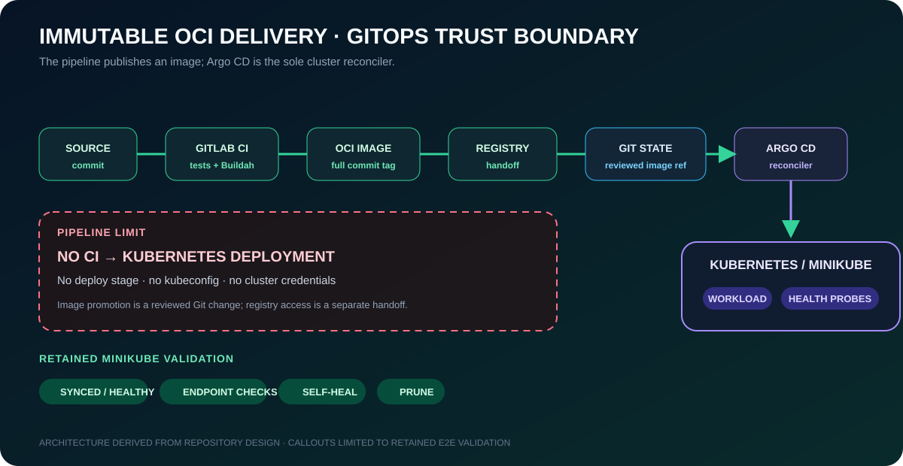

# Flask Kubernetes GitOps Lab

> A hardened Flask workload delivered as an immutable OCI image by GitLab CI and reconciled to Kubernetes by Argo CD—without giving the build pipeline cluster credentials.

[](https://github.com/goozcena-gnl/flask-kubernetes-gitops-lab/actions/workflows/validate.yml)
[](https://github.com/goozcena-gnl/flask-kubernetes-gitops-lab/releases/latest)
[](LICENSE)

Validated on Minikube with Traefik: private-registry image pull by digest, Argo CD `Synced`/`Healthy` state, `/`, `/healthz`, and `/readyz` responses, drift self-heal, and resource pruning all passed.

GitLab CI validates the application, builds it with Buildah, and publishes a full-commit-SHA image tag. The pipeline has no deploy stage or kubeconfig; image promotion is reviewed in Git, and Argo CD is the sole cluster reconciler. This is a Minikube application-delivery lab, not a production-readiness claim. See the [E2E validation record](docs/minikube-argocd-e2e.md) and [limitations](#limitations).

## Architecture

GitLab CI validates the source, builds an OCI image, and publishes an immutable tag based on the full commit SHA. Kubernetes desired state remains in Git. Argo CD is the only deployment controller; the pipeline does not hold a kubeconfig or call `kubectl`.

Before installation, use this technical review path:

- [decision and trade-off synthesis](docs/architecture.md#decision-and-trade-off-synthesis);
- [security decisions](docs/security-decisions.md);
- [validated Minikube evidence](docs/minikube-argocd-e2e.md);
- [explicit limitations](#limitations).

<p align="center">
  
</p>

<p align="center"><sub><strong>Architecture + retained validation boundary.</strong> CI ends at the registry; it has no kubeconfig and does not deploy. The reviewed Git state crosses the cluster trust boundary through Argo CD.</sub></p>

## Capabilities

- Python endpoint testing and linting;
- deterministic multi-stage container builds and non-root runtime design;
- Buildah-based GitLab CI with OCI artifacts and protected registry variables;
- Kubernetes Deployment, Service, Ingress, probes, resources, Kustomize, and restricted Pod Security settings;
- Argo CD automated sync, prune, and self-heal;
- Helm values for GitLab, Argo CD, Traefik, and Minikube;
- credential sanitisation, safe examples, and reproducible validation.

## Repository structure

```text
.
├── app/                         Flask source, dependencies, and tests
├── deploy/
│   ├── argocd/                  Application and safe repository Secret example
│   ├── helm-values/             One values file per platform component
│   └── kubernetes/              Base manifests and optional storage overlay
├── docs/                        Architecture, security decisions, and canonical report
├── scripts/                     Validation, secret scan, and image update helpers
├── .gitlab-ci.yml               Validate, build, and publish pipeline
└── Dockerfile                   Hardened multi-stage image
```

## Prerequisites

For local application checks: Python 3.12 and `pip`.

For the complete local GitOps lab:

- Docker;
- Minikube;
- kubectl;
- Helm;
- Traefik OSS;
- Argo CD;
- access to the private GitLab Container Registry.

## Local application test

```bash
python -m venv .venv
. .venv/bin/activate
python -m pip install -r app/requirements.txt -r app/requirements-dev.txt
pytest -q
python -m flask --app app.app run --host 127.0.0.1 --port 8080
```

Verify `http://127.0.0.1:8080/`, `/healthz`, and `/readyz`.

## Container build and run

```bash
docker build -t flask-k8s-lab:local .
docker run --rm -p 8080:8080 --read-only --tmpfs /tmp flask-k8s-lab:local
```

The default build uses `python:3.12.13-alpine3.22`. An approved digest can be supplied without modifying the Dockerfile:

```bash
docker build --build-arg PYTHON_IMAGE='python:3.12.13-alpine3.22@sha256:<APPROVED_DIGEST>' .
```

## Kubernetes deployment

Promote the reviewed registry digest through the Minikube overlay, prove that
Kustomize renders that exact reference, then apply the overlay:

```bash
python scripts/set-image.py \
  registry.example.com/team/flask-k8s-lab@sha256:<64-hex-character-digest>
python scripts/check-rendered-image.py
kubectl apply -k deploy/kubernetes/overlays/minikube
kubectl -n flask-k8s-lab rollout status deployment/flask-k8s-lab
kubectl -n flask-k8s-lab port-forward service/flask-k8s-lab 8080:80
```

The Ingress host is the documentation-only domain `flask-k8s-lab.example.test`. Replace it for the target environment. TLS is intentionally not embedded; use cert-manager or create the TLS Secret outside Git.

The application is stateless. The optional PVC exercise is applied only when explicitly selected:

```bash
kubectl apply -k deploy/kubernetes/optional-storage
```

## GitLab CI/CD workflow

### GitLab Container Registry authentication

When the GitLab Container Registry is enabled, the publish job uses GitLab's
job-scoped predefined variables:

- `CI_REGISTRY`
- `CI_REGISTRY_IMAGE`
- `CI_REGISTRY_USER`
- `CI_REGISTRY_PASSWORD`

No permanent registry password is required for the pipeline.

For an external OCI registry, adapt the publish job and store credentials as
masked and protected CI/CD variables.

The pipeline stages are:

1. `validate`: syntax, tests, Ruff, YAML, Markdown links, and fallback secret scan;
2. `build`: Buildah creates an OCI archive;
3. `publish`: the archive is imported and pushed with `$CI_COMMIT_SHA` as the tag.

There is no deploy stage and no `KUBECONFIG_B64`. After publication, resolve
the published artifact to its immutable registry digest outside the helper,
then record that digest in the reviewed Minikube overlay:

```bash
python scripts/set-image.py \
  "$REGISTRY_HOST/$REGISTRY_NAMESPACE/$CI_PROJECT_PATH_SLUG@sha256:$IMAGE_DIGEST"
python scripts/check-rendered-image.py
```

The helper never logs in to a registry or resolves a mutable tag. It changes
exactly the base-image transformation in
`deploy/kubernetes/overlays/minikube/kustomization.yaml`; the reusable base
remains environment-neutral. Promotion is: published artifact → immutable
digest selected in the reviewed overlay → exact rendered-image validation →
Git merge → Argo CD reconciliation.

## Argo CD workflow

1. Install Argo CD with an explicitly pinned chart version and adapt `deploy/helm-values/argocd.yaml`.
2. For a private repository, copy `deploy/argocd/repository-secret.example.yaml` outside the repository, replace every placeholder, apply it locally, and delete the working copy.
3. Select the Application manifest for the target environment. The validated
   Minikube command is kept once in the next section.

Argo CD watches `deploy/kubernetes/overlays/minikube`, creates the namespace, prunes removed resources, and self-heals drift.

## Minikube GitOps environment

Bootstrap the local platform:

```bash
./scripts/bootstrap-minikube-platform.sh
```

Create the local registry pull Secret:

```bash
./scripts/create-gitlab-registry-secret.sh
```

Apply the Argo CD Application:

```bash
kubectl apply -f deploy/argocd/application-minikube.yaml
```

Expose Traefik:

```bash
./scripts/port-forward-traefik.sh
```

Open:

```
http://flask-k8s-lab.localhost:8081/
```

## GitLab, Argo CD, and Traefik values

The files under `deploy/helm-values/` are portable starting points. They deliberately contain generic domains and no storage class or IP address. Choose and record compatible chart versions before installation, for example:

```bash
helm upgrade --install traefik traefik/traefik \
  --namespace traefik --create-namespace \
  --version <PINNED_CHART_VERSION> \
  -f deploy/helm-values/traefik-minikube.yaml
```

## Security model

The workload runs as UID/GID `10001`, drops all capabilities, prevents privilege escalation, uses the runtime-default seccomp profile, disables service-account token mounting, and mounts `/tmp` over a read-only root filesystem. No key, kubeconfig, real Secret, generated certificate, public IP, or private endpoint belongs in this repository.

See [security decisions](docs/security-decisions.md). Credentials from the original archive must be rotated or revoked if they were ever active.

## Validation

After installing development dependencies:

```bash
./scripts/validate.sh
```

Optional checks run when `hadolint`, `kubeconform`, and `kubectl` are available.
When a Kustomize renderer is available, validation renders both the base and
Minikube overlay and proves the promoted digest equals the Deployment image.
Docker build, container smoke testing, Helm rendering, and GitLab CI lint
require their respective external runtimes or services.

## Documentation

- [Anonymised project brief](docs/project-brief.md)
- [Architecture](docs/architecture.md)
- [Security decisions](docs/security-decisions.md)
- [Canonical lab report](docs/lab-report.md)
- [Validation report](docs/validation-report.md)
- [Minikube, Traefik, and Argo CD E2E validation](docs/minikube-argocd-e2e.md)

## License

Original project content is licensed under the [MIT License](LICENSE).
Third-party dependencies remain subject to their own licenses.

## Limitations

This is a demonstration lab, not a production GitLab or Kubernetes platform. DNS, TLS, registry authentication, storage provisioning, LoadBalancer support, chart compatibility, and resource sizing remain environment-specific.
