# Architecture

## Delivery flow

```mermaid
flowchart LR
    DEV[Developer change] --> GIT[Git repository]
    GIT --> CI[GitLab CI validation]
    CI --> BUILD[Buildah image build]
    BUILD --> REG[OCI registry\nimmutable commit tag]
    REG --> PR[Manifest image update\nreviewed in Git]
    PR --> GITOPS[Git desired state]
    GITOPS --> ARGO[Argo CD reconciliation]
    ARGO --> K8S[Kubernetes]
    K8S --> ING[ingress-nginx]
    ING --> APP[Flask application]
```

GitLab CI does not receive a kubeconfig and does not call `kubectl`. This prevents the earlier direct-deployment mechanism from competing with Argo CD. After an image is published, `scripts/set-image.py` updates the image reference. The resulting change is reviewed and merged before Argo CD reconciles it.

## Runtime design

The application is stateless. Two replicas run as UID/GID `10001`, without a service-account token, Linux capabilities, privilege escalation, or a writable root filesystem. An `emptyDir` volume provides the only required writable path at `/tmp`.

The base deployment does not require persistent storage. `deploy/kubernetes/optional-storage` is retained only as a learning exercise and deliberately omits a storage class so the target cluster can select its default provisioner.

## TLS strategy

No generated certificate or private key is stored in Git. The portable base Ingress is HTTP-only. A real environment should add TLS with cert-manager, an external secret manager, or a locally created Kubernetes TLS Secret. Repository certificate trust for Argo CD must likewise be configured out of band.
