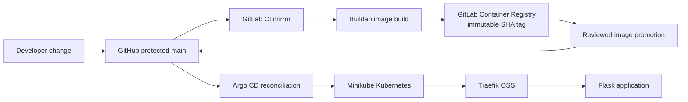

# Architecture

## Delivery flow

```mermaid
flowchart LR
    DEV[Developer change] --> GITHUB[GitHub protected main]
    GITHUB --> GITLAB[GitLab CI mirror]
    GITLAB --> BUILD[Buildah image build]
    BUILD --> REG[GitLab Container Registry\nimmutable SHA tag]
    REG --> PROMOTE[Reviewed image promotion]
    PROMOTE --> GITHUB
    GITHUB --> ARGO[Argo CD reconciliation]
    ARGO --> MINI[Minikube Kubernetes]
    MINI --> TRAEFIK[Traefik OSS]
    TRAEFIK --> APP[Flask application]
```

GitLab CI does not receive a kubeconfig and does not call `kubectl`. GitHub
`main` is the canonical Git history; the GitLab repository serves as a CI and
registry mirror. After publication, an immutable digest is selected and
`scripts/set-image.py` records it in the Minikube overlay's single base-image
transformation. `scripts/check-rendered-image.py` proves the selected digest is
byte-for-byte identical to the `application` container image rendered by
Kustomize. The change is reviewed and merged on GitHub before Argo CD
reconciles `deploy/kubernetes/overlays/minikube`.

## Decision and trade-off synthesis

### Problem

The delivery design must build and publish a traceable container without
turning the build pipeline into a Kubernetes administrator. It also needs an
auditable promotion step between a published artifact and the cluster's
desired state.

### Responsibility split

| Boundary | Responsibility | Explicit exclusion |
|---|---|---|
| GitHub protected `main` | Canonical source and reviewed desired state | Does not store runtime credentials |
| GitLab CI | Test, build with Buildah, and publish the full-commit-SHA OCI artifact | No deploy stage, kubeconfig, or cluster credentials |
| Container registry | Store the published artifact for later pull | Does not decide promotion |
| Reviewed Git change | Select the image reference for the target environment | Does not mutate the cluster directly |
| Argo CD | Sole reconciler of reviewed desired state | Does not build or publish images |
| Kubernetes | Pull and run the declared workload | Receives no credential from GitLab CI |

The resulting path is published artifact → immutable digest selected in the
reviewed Kustomize overlay → exact rendered-image validation → Git merge →
Argo CD reconciliation. Publication and deployment are separate control
points, and the reusable base remains environment-neutral.

### Key decisions and trade-offs

- A full commit SHA makes the CI artifact traceable to source. The validated
  Minikube desired state uses a digest, making the pulled image bytes explicit;
  resolving and reviewing that reference adds a deliberate promotion step.
- Keeping Kubernetes credentials out of CI reduces the pipeline's privilege,
  but a successful build cannot deploy itself. Promotion waits for a reviewed
  Git change and Argo CD reconciliation.
- Argo CD prune and self-heal reduce unmanaged drift. They also make an
  incorrect merged desired-state change authoritative, so protected review is
  part of the operational control.
- Kustomize bases and overlays separate reusable manifests from Minikube
  choices, but they do not prove portability to another cluster.

### Security choices

- The container runs as non-root UID/GID `10001`, drops capabilities, prevents
  privilege escalation, uses `RuntimeDefault` seccomp, and has a read-only root
  filesystem with only `/tmp` writable.
- GitLab registry credentials are job-scoped variables; pipeline authentication
  material is removed after publication. The private-registry pull credential
  is created locally in Kubernetes and is not stored in Git.
- Argo CD repository credentials are supplied outside the repository. The
  checked-in Secret is a placeholder example only.

See [security decisions](security-decisions.md) for the complete control and
sanitisation context.

### What was validated

The public record covers repository validation plus one bounded Minikube run:
private-registry digest pull, Argo CD `Synced`/`Healthy`, Traefik routing,
application endpoints, self-heal, and prune. See the
[validation report](validation-report.md) and
[Minikube E2E record](minikube-argocd-e2e.md). The private GitLab record is
sanitized and does not provide independently inspectable public job URLs; see
[GitLab operational validation](gitlab-operational-validation.md).

### Failure boundaries

- A test, Buildah, or publication failure stops before desired state changes.
- A missing image, registry pull credential, or registry connection prevents
  the workload from becoming Ready; CI does not repair cluster access.
- An unmerged promotion change cannot reach Argo CD.
- A repository or reconciliation failure leaves Argo CD unable to converge on
  the new revision; it is not evidence that the application was deployed.
- Failed startup, readiness, or liveness checks remain workload failures even
  when Git synchronization succeeds.

### Limitations

The retained runtime evidence is Minikube-specific and non-production. It does
not validate managed Kubernetes, public traffic, production registry controls,
TLS or DNS, portable storage, high availability, or production sizing.

### What changes for production

A production design must define and validate the target cluster, registry
immutability and artifact provenance policy, credential lifecycle, TLS and DNS,
storage, availability, observability, rollback, and promotion approvals. Those
controls remain environment decisions; this repository does not claim them as
implemented.

## Runtime design

The application is stateless. Two replicas run as UID/GID `10001`, without a service-account token, Linux capabilities, privilege escalation, or a writable root filesystem. An `emptyDir` volume provides the only required writable path at `/tmp`.

The base deployment does not require persistent storage. `deploy/kubernetes/optional-storage` is retained only as a learning exercise and deliberately omits a storage class so the target cluster can select its default provisioner.

## TLS strategy

No generated certificate or private key is stored in Git. The portable base Ingress is HTTP-only. A real environment should add TLS with cert-manager, an external secret manager, or a locally created Kubernetes TLS Secret. Repository certificate trust for Argo CD must likewise be configured out of band.
