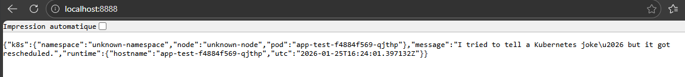
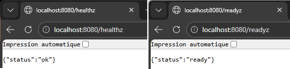

# Lab report

## Purpose

This lab demonstrates the path from a minimal Flask service to a hardened container, an immutable GitLab CI image build, and an Argo CD-managed Kubernetes deployment.

## Historical evidence retained from the source material

The source report documented a completed learning environment that included GitLab on Kubernetes, a GitLab Runner, Buildah image publication, Kubernetes probes and Ingress access, an optional volume exercise, and an Argo CD installation. Environment-specific commands, credentials, addresses, account names, and third-party assessment wording were removed during publication.

The two retained images are limited to localhost application evidence:





These screenshots document the historical lab run. They are not presented as evidence that the cleaned repository was rebuilt in the current execution environment.

## Final implementation

### Application

The application exposes `/`, `/healthz`, and `/readyz`. The root response includes runtime information and values normally populated through the Kubernetes Downward API. Tests cover all three routes and verify RFC 3339 UTC formatting.

### Image

The image uses a multi-stage Dockerfile and runs as UID/GID `10001`. The build installs only two runtime Python packages. The runtime stage remains free of compilers and uses a Python standard-library health check.

### Kubernetes

The base Kustomize package contains a Namespace, Deployment, Service, and Ingress. The workload meets the restricted Pod Security profile and uses `/tmp` as an explicit writable volume. Persistent storage is separated into an optional overlay because the Flask service is stateless.

### GitLab CI

The active pipeline has three stages: `validate`, `build`, and `publish`. It runs validation for merge requests and pushes. Buildah produces an OCI archive; the publish job imports that artifact and pushes an image tagged with the full commit SHA. Registry credentials must be masked and protected variables.

### Argo CD

The Argo CD Application watches `deploy/kubernetes/base` and performs automated prune and self-heal. The former direct `kubectl` deployment was removed. Updating the image in Git is a separate, reviewable action:

```bash
python scripts/set-image.py registry.example.com/team/flask-k8s-lab:<commit-sha>
git add deploy/kubernetes/base/deployment.yaml
git commit -m "deploy: promote flask image <commit-sha>"
```

## Limitations

- GitLab, Argo CD, and ingress-nginx values are portable starting points, not production sizing guidance.
- Chart versions must be selected and pinned by the operator at installation time.
- DNS, LoadBalancer support, TLS issuance, registry access, and a default storage class depend on the target cluster.
- The current environment did not provide Docker, Kubernetes, Helm, or GitLab CI lint services; those validations must be performed where the tools and cluster are available.
